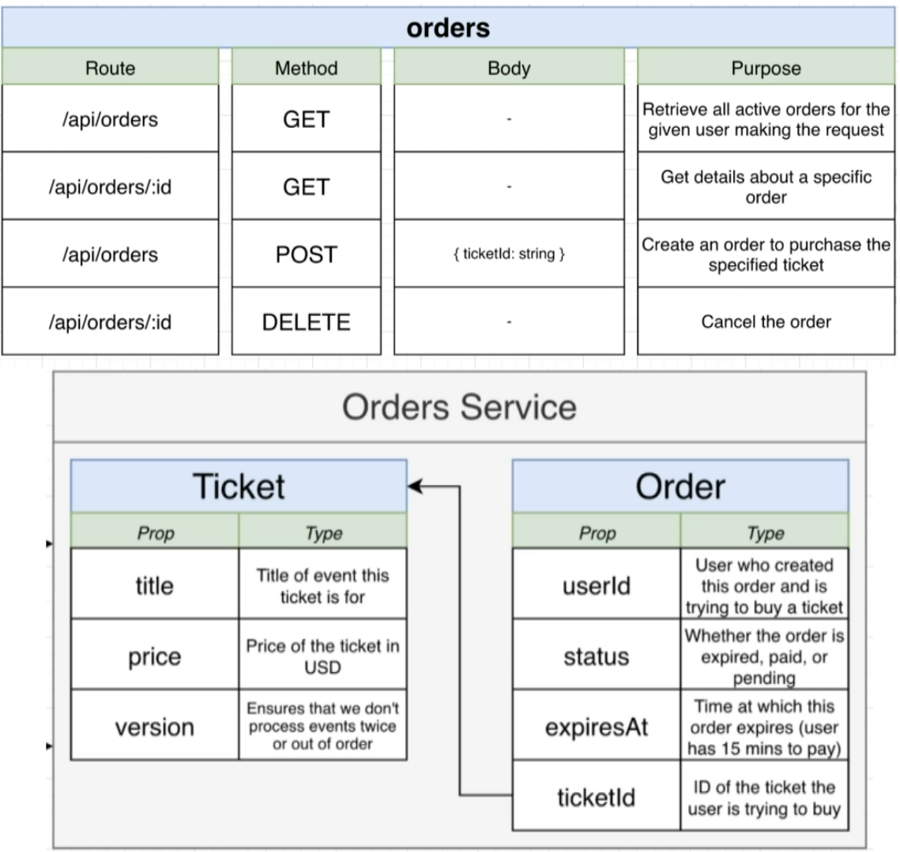
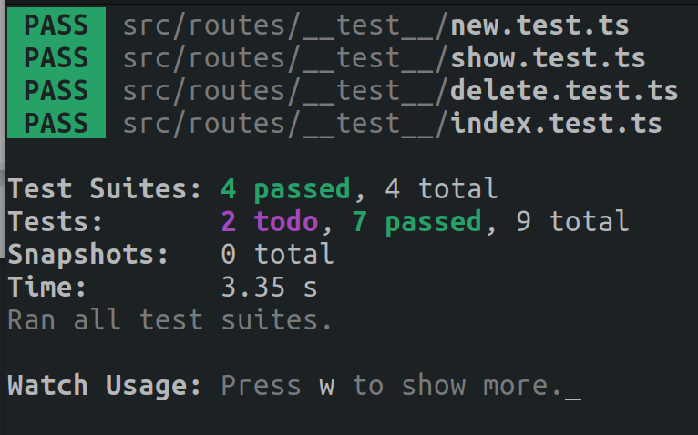
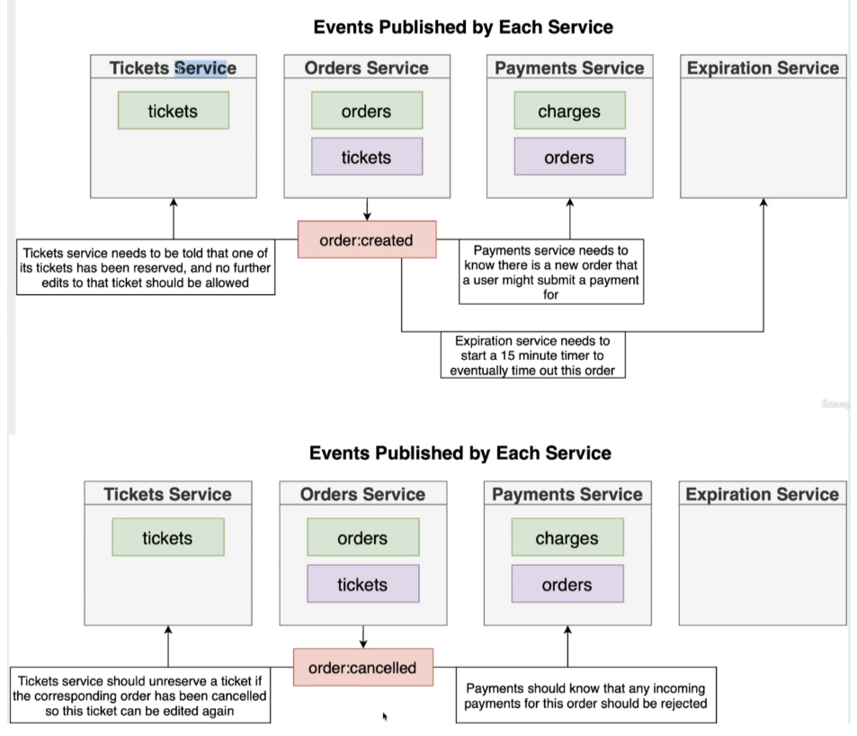
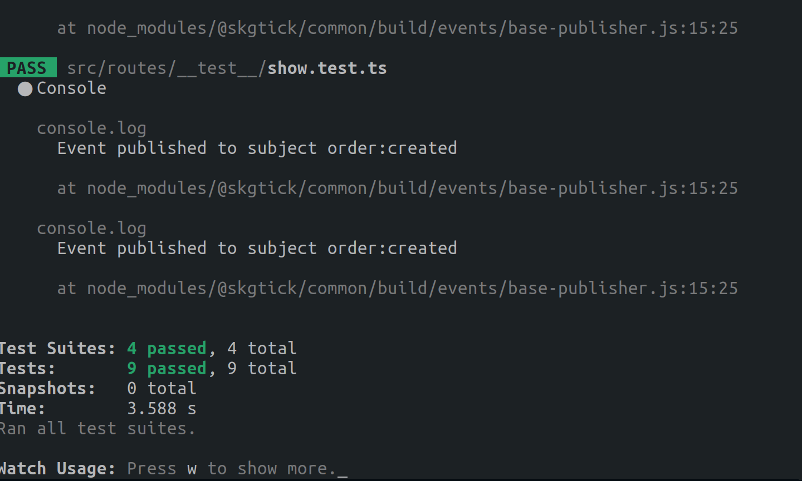

What is the Order Service?
The Order Service provides users with information about their various orders. Users can add new tickets to their orders or remove tickets from them. When a user adds a ticket to their order, the Order Service automatically sets an expiration date and time to ensure the order is reserved for the current user.

Here are some outputs related to my architecture, including different route handlers and the associated models.

output:

What measures did you take for event handling?
To handle events, I implemented a natsWrapper class, which is a singleton event handler. Building on the changes I made in the previous branch for implementing NATS Streaming, I created publishers for orders when the order status is created and when it is canceled. This ensures that other services, such as the Ticket Service, are aware when an order is created and thus cannot change the price of the reserved order. Similarly, they will know when the order is canceled, allowing price changes again.

How did you approach the creation of the service?
I began by creating the route handlers and then wrote test cases to ensure orders were created and published correctly. Additionally, I used a mock natsWrapper class to generate a fake wrapper class for callbacks instead of using the actual natsWrapper class.
