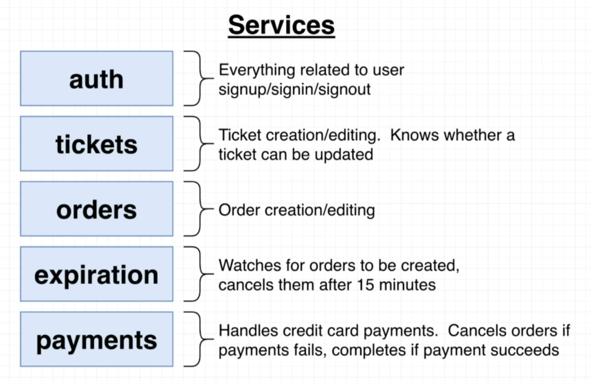
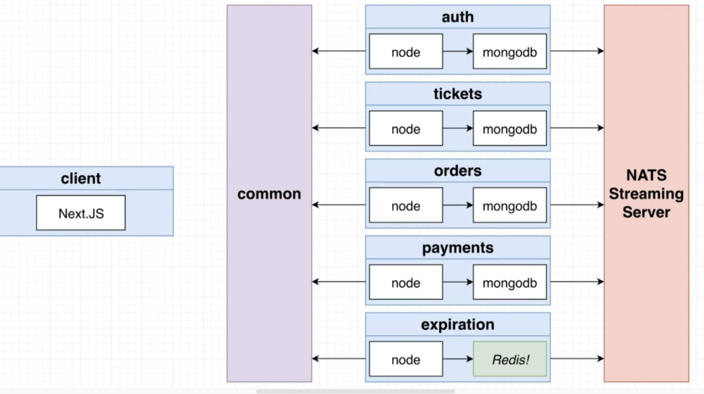

Hi This is a new project for creating a ticketing based application based on "stub hub"
Understanding microservice architecture and various tools associated with it.

This is my high level diagram of the services involved in creating this application.

This is a high level architecture of the design.

