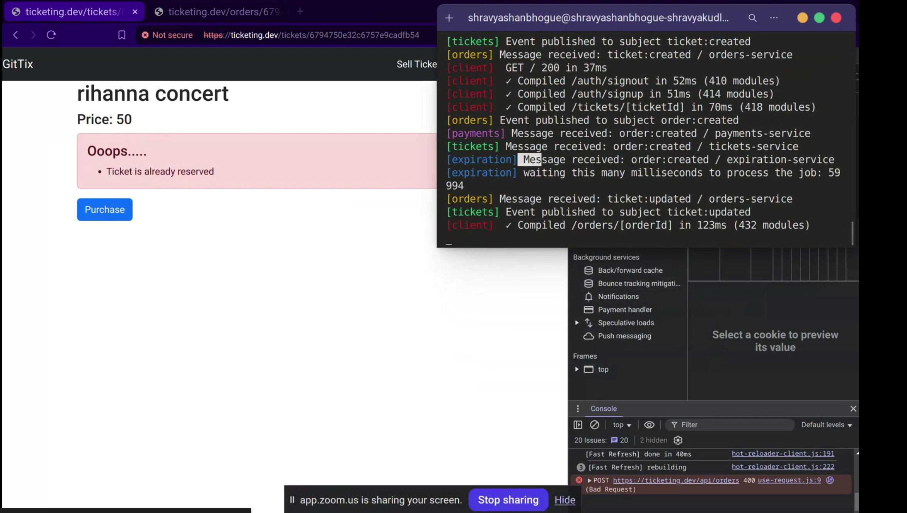

# 🎫 Concert Ticketing Platform

A modern concert ticketing website where users can **buy** and **sell** tickets with ease.

## 🔥 Key Features

- 🛒 **Cart Hold Logic**: When a buyer adds a ticket to their cart, it's held for **10 minutes** using **Redis** If the purchase isn't completed, it's released back to the seller — who can then resell or increase the price.
- 🔐 **Authentication**: Secure login and signup using **JWT**.
- 💳 **Payments**: Real-time payment integration using **Stripe API**.
- 📣 **Event-Driven Architecture**: Services communicate using **NATS Streaming**, enabling real-time updates and loosely coupled microservices.
- 🧪 **Testing**: **Jest** is used for unit and integration tests.
- 🔄 **CI/CD**: Automated testing and deployment via **GitHub Actions**.
- 🐳 **Containerized**: All services are containerized with **Docker**.
- ☸️ **Orchestration**: Managed using **Kubernetes** with **NGINX** as the ingress controller.
- ⚙️ **Development Tooling**: Uses **Skaffold** for fast and efficient local development.

## 🎥 Demo

---

## 🚀 Tech Stack

- **Frontend**: React
- **Backend**: Node.js, Express
- **Database**: MongoDB (running in Docker container)
- **Authentication**: JWT
- **Payments**: Stripe
- **Messaging**: NATS Streaming
- **Containers**: Docker, Kubernetes, NGINX
- **Dev Tools**: Skaffold, GitHub Actions, Jest

