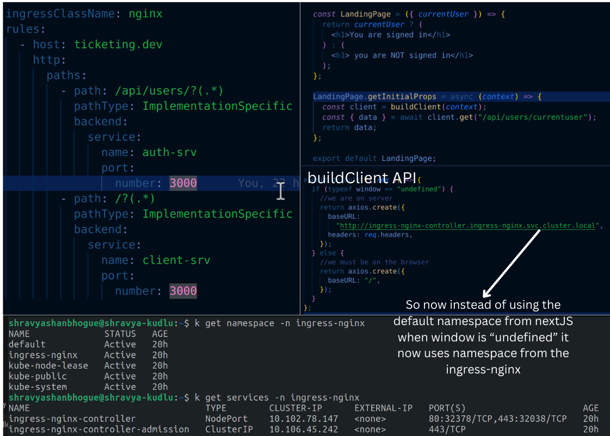

What?
Setting up Next.js with React to enhance my authentication service's user interaction.

Challenge:
Ensuring Next.js correctly interacts with an ingress-nginx setup, switching between server-side rendering (SSR) and its built-in route handler, especially when using the getInitialProps function.

Resolution:
Implemented Kubernetes namespaces to fetch the ingress namespace dynamically. Integrated this logic into the header component, enabling Next.js to seamlessly determine the routing strategy based on the environment. SSR improves performance and SEO by pre-rendering pages on the server, ensuring faster initial load times and enabling search engines to index content effectively, crucial for enhancing user experience and discoverability in my application.
Pictures:

This is my output:

