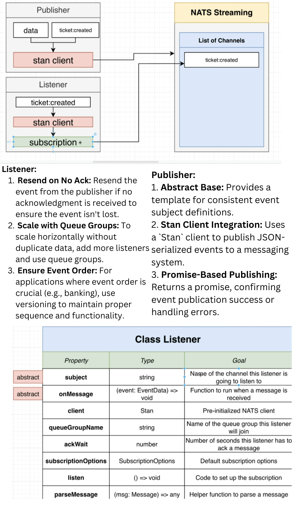
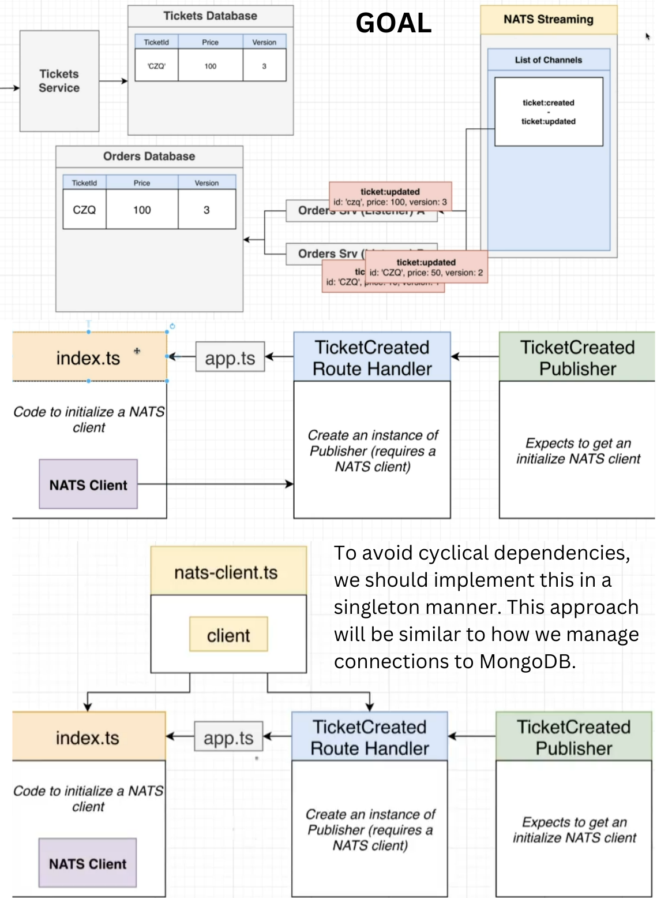
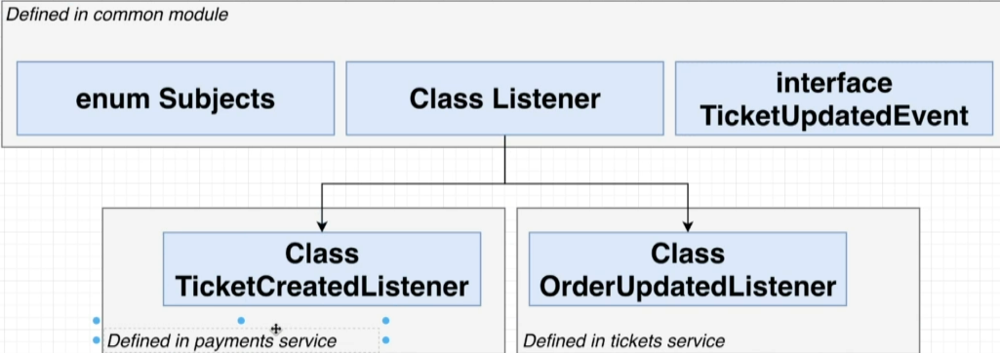

# Service Overview

## What is This Service?

This project is divided into two main sections:

1. **NATS Streaming Service Exploration**: This part focuses on understanding and implementing a basic NATS Streaming setup. It includes:
   - **Publisher**: Publishes events to the NATS Streaming service.
   - **Listener**: Listens to and processes these events.
2. **Integration with Ticket Service**: The second part involves integrating the NATS Streaming setup with a ticketing service. It includes:
   - Defining various events within the ticket service.
   - Ensuring that the publisher communicates these events to other services.

## Part 1: NATS Streaming Architecture

### Architecture and Challenges

In Part 1, the focus was on establishing the basic publisher and listener setup. Here are some outputs from this phase:

Output:

## Part 2: Scaling and Integration

### Enhanced Architecture and Challenges

After completing Part 1, I scaled up the setup to allow for more advanced integrations. This phase includes:

- **Base Publisher and Base Listener**: These components are used to create and manage various events for the ticket service or other services in the future.
- **Consistency Improvements**: Introduced a `connectToNatsStreaming` function to align with the way connections to MongoDB are handled.
  

### Scaling Up

The scaling phase involved extending the initial setup to support a broader range of events and services. Here are some outputs from this phase:

Output:
