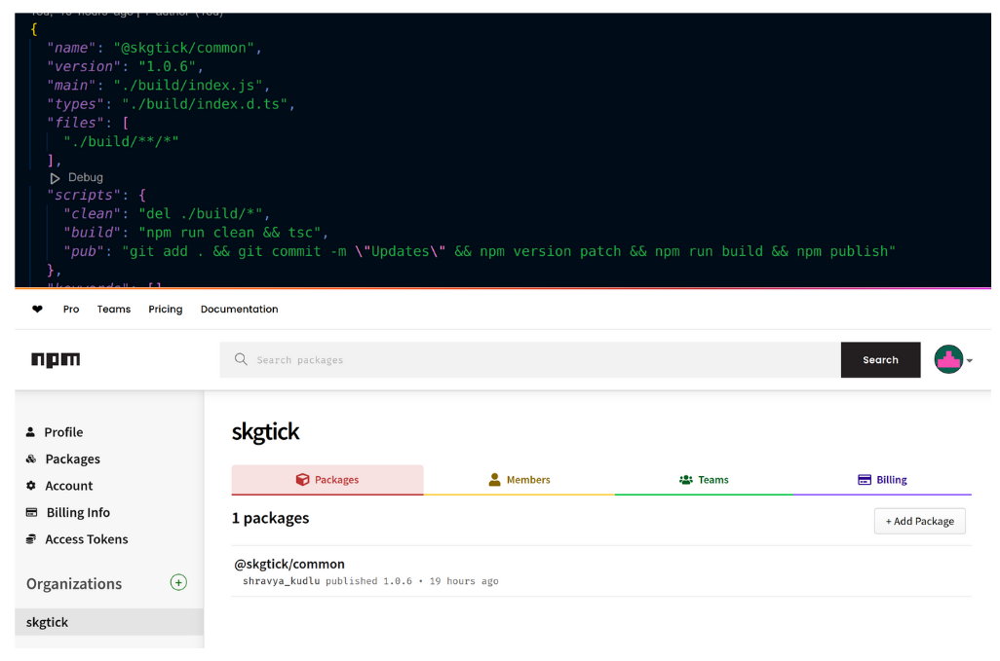
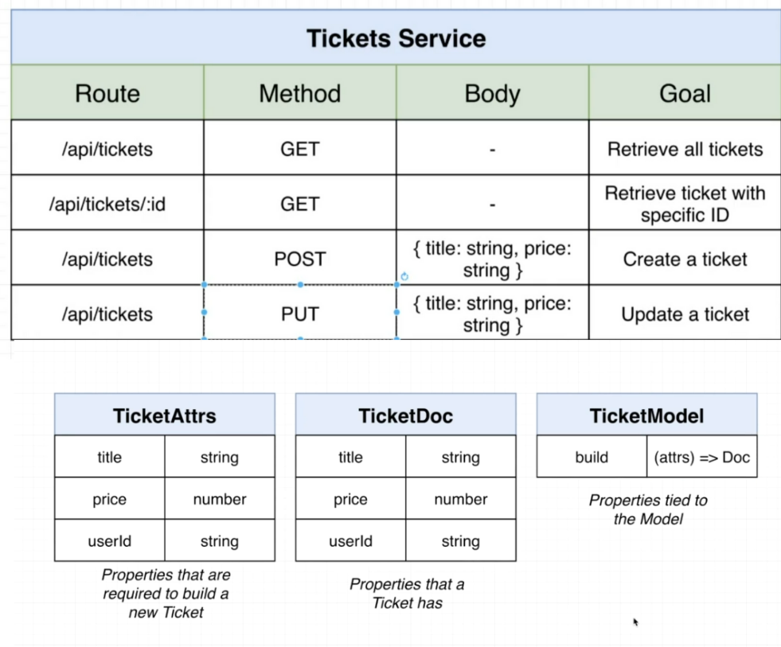
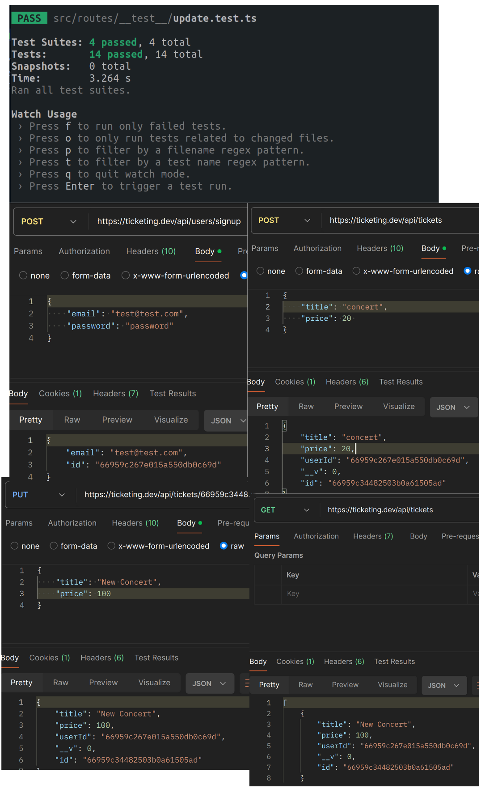

What is the Ticket Service?
The Ticket Service informs the user about the various tickets available to them after they log in. Users can add new tickets and modify existing ones as needed.

How did you scale and prepare?
From the Auth Service, I extracted several components like middleware and custom errors and published them as a public repository on NPMJS. This allows me to reuse these components in other services.

Here are some outputs related to my architecture, including different route handlers and the associated models.

How did you approach the creation of the service?
I followed a test-first approach. I used Jest to write tests for various route handlers, implemented the handlers, and ensured the tests passed. Finally, I integrated it with ingress for testing directly in Postman.

Output:

